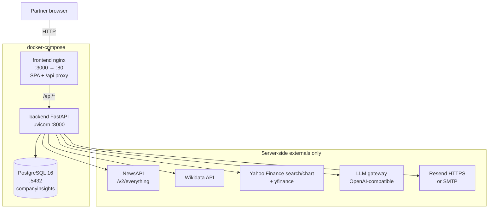
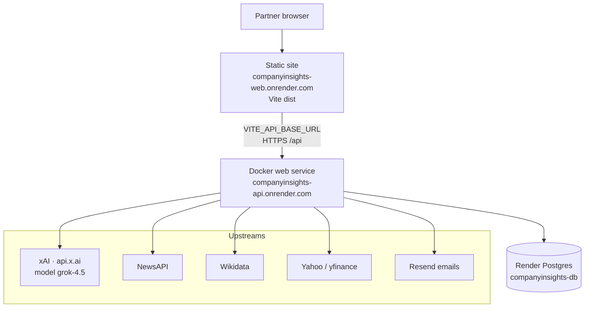
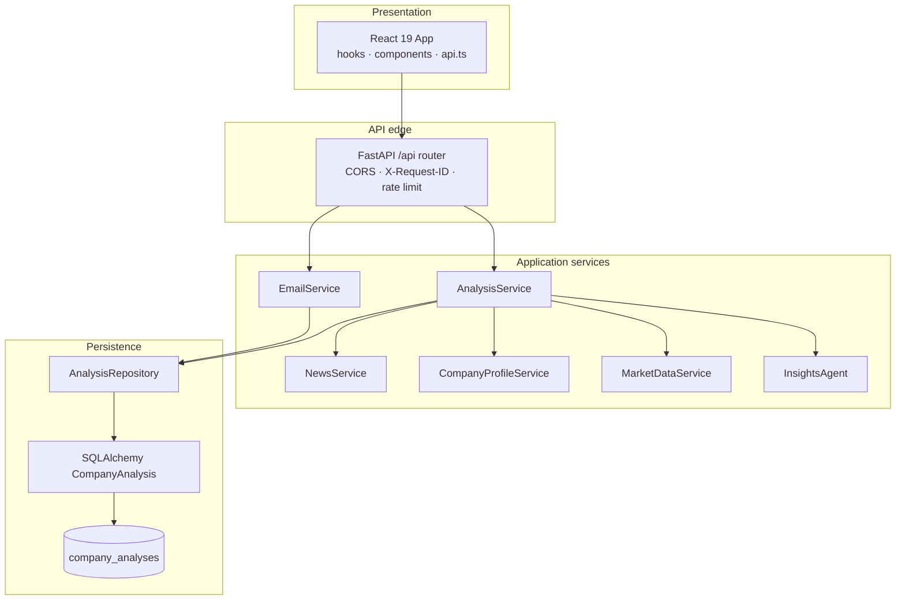

# Architecture 01 — System Overview

**Company Insights** turns a company name into a partner-ready brief: recent news, Wikidata profile, Yahoo market snapshot, LLM synthesis, optional email, and a dig-deeper expand path.

Source of truth: `docker-compose.yml`, `render.yaml`, `backend/app/*`, `frontend/src/*`.

---

## 1. Runtime topology (local Docker)

**Dev alternate:** Vite `:5173` proxies `/api` → `localhost:8000` (same backend contracts).

---

## 2. Runtime topology (Render production)

| Difference | Local Compose | Render |
| --- | --- | --- |
| UI hosting | nginx container, same-origin `/api` | Static site, cross-origin API |
| DB | `postgres:16-alpine` | Managed Postgres |
| LLM default | `.env` (`LLM_*`) | `https://api.x.ai/v1` · `grok-4.5` |
| Email | Resend or SMTP | Prefer Resend (SMTP often blocked) |
| Quotas | Looser defaults | Stricter cache / rate / article caps |

---

## 3. Logical layer boundaries

---

## 4. External dependency map

| Dependency | Service file | Protocol | Auth |
| --- | --- | --- | --- |
| NewsAPI | `news_service.py` | REST GET | `NEWS_API_KEY` |
| Wikidata | `company_profile_service.py` | MediaWiki API | none |
| Yahoo Finance + yfinance | `market_data_service.py` | HTTP + Python lib | none |
| LLM (OpenAI SDK) | `insights_agent.py` | chat.completions JSON | `LLM_API_KEY` |
| Resend | `email_service.py` | HTTPS POST | `RESEND_API_KEY` |
| SMTP | `email_service.py` | smtplib | SMTP_* |
| PostgreSQL | `database.py` / repository | SQLAlchemy | `DATABASE_URL` |

Demo / fallback: missing news key → demo articles; missing/failing LLM → `fallback-heuristic` brief.

---

## 5. Key file anchors

| Concern | Path |
| --- | --- |
| Compose | `docker-compose.yml` |
| Render | `render.yaml` |
| App factory | `backend/app/main.py` |
| Routes | `backend/app/api/routes.py` |
| Orchestration | `backend/app/services/analysis_service.py` |
| LLM | `backend/app/services/insights_agent.py` |
| Frontend shell | `frontend/src/App.tsx` |
| API client | `frontend/src/api.ts` |
| nginx proxy | `frontend/nginx.conf` |
