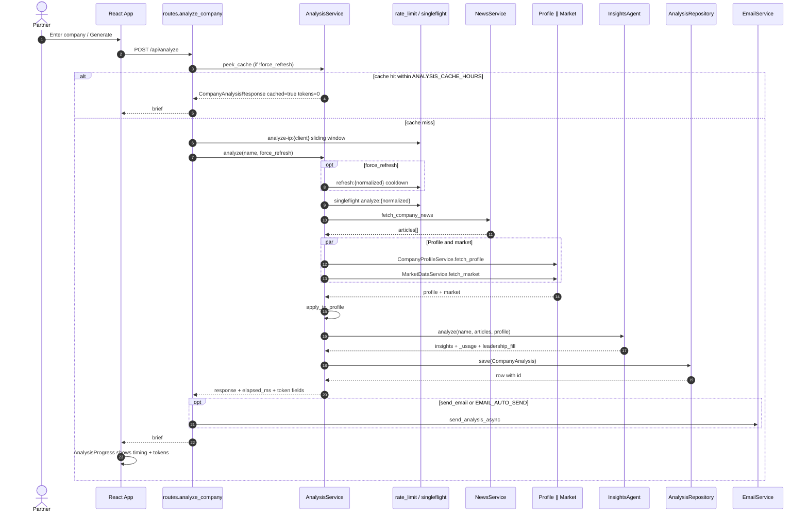
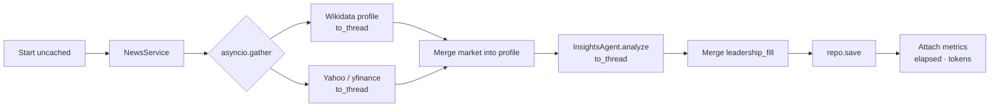
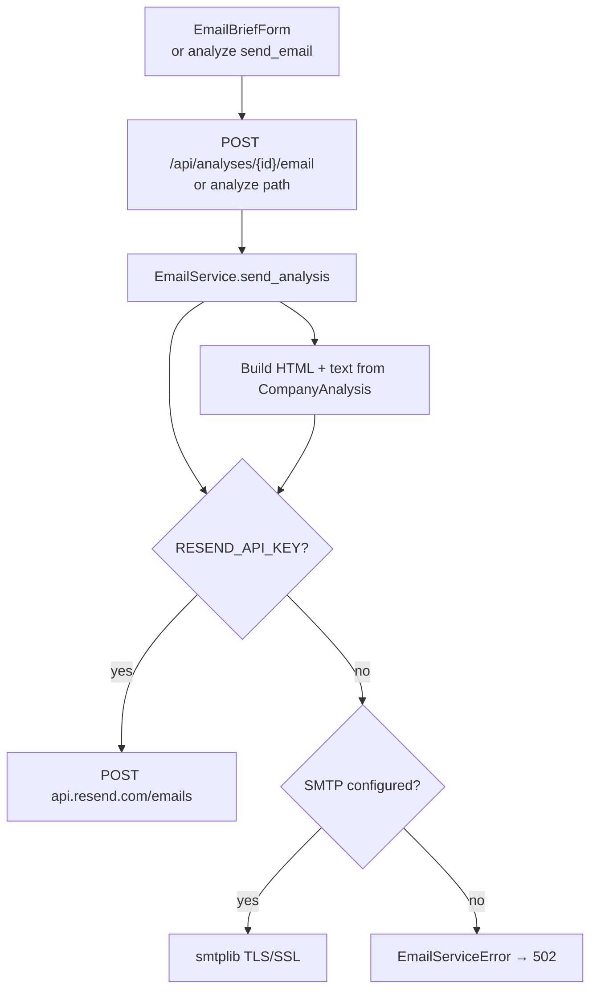
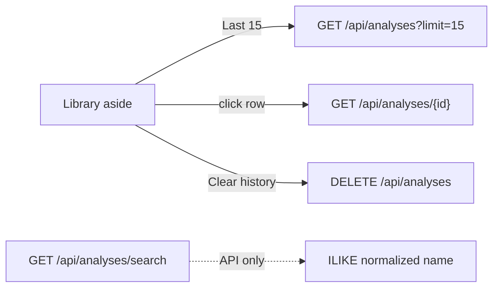
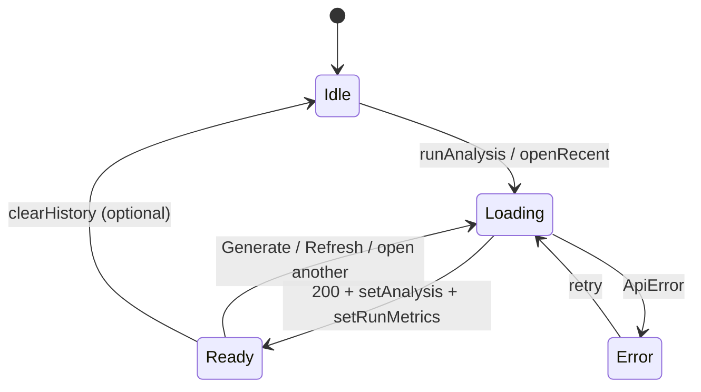

# Architecture 02 — Analyze, Expand, Email, Library Flows

Detailed request sequences for the four partner-facing workflows.

---

## 1. Analyze — happy path (uncached)

**Endpoint:** `POST /api/analyze`  
**Body:** `{ company_name, force_refresh?, send_email?, email_to? }`  
**UI:** Generate / Refresh → `useCompanyInsights.runAnalysis` → `api.analyzeCompany`



### Parallelism inside `_analyze_uncached`



### Cache / rate-limit policy

| Condition | Rate limit | Upstream calls | Tokens returned |
| --- | --- | --- | --- |
| Cache hit (`!force_refresh`) | Skipped | None | `0` |
| Fresh analyze | IP window applied | News + profile + market + LLM | Real usage |
| Refresh under cooldown + non-fallback cache | May serve cache | None | `0` |
| Refresh under cooldown + fallback brief | Allowed to re-run | Full pipeline | Real usage |

---

## 2. Dig-deeper expand

**Endpoint:** `POST /api/analyses/{analysis_id}/expand`  
**Body:** `{ kind: opportunity\|risk\|recommendation, index, depth: standard\|deep, prior_analysis? }`

```mermaid
sequenceDiagram
  autonumber
  actor P as Partner
  participant Panel as InsightsPanel
  participant Modal as InsightDrillModal
  participant R as routes.expand_insight
  participant S as AnalysisService.expand_insight
  participant L as InsightsAgent.expand_item
  participant DB as AnalysisRepository

  P->>Panel: Click opportunity / risk / recommendation
  Panel->>Modal: open drill
  P->>Modal: Ask more (standard)
  Modal->>R: POST .../expand depth=standard
  R->>S: expand_insight
  S->>DB: get_by_id
  S->>S: pick item by kind+index
  S->>L: expand_item + match sources
  L-->>S: ExpandInsightResponse
  S-->>Modal: analysis + questions + moves + sources
  opt Dig deeper again
    P->>Modal: deep dig
    Modal->>R: POST .../expand depth=deep + prior_analysis
    R->>S->>L: deep narrative + spotlight_points
    L-->>Modal: deep payload
  end
```

**Not persisted.** Client caches expand payloads in React state. No IP rate limit on expand today.

| Depth | Fields |
| --- | --- |
| `standard` | `deeper_analysis`, `why_it_matters`, `questions_to_ask`, `suggested_moves`, `sources` |
| `deep` | `detailed_narrative`, `spotlight_points`, `sources` |

---

## 3. Email brief



- Explicit UI email failures surface to the client.
- `EMAIL_AUTO_SEND` failures are logged only (analyze still succeeds).

---

## 4. Library / history



“Last 15” is a **max**, not a fill. If fewer rows exist, fewer are shown.

---

## 5. Frontend state machine (analyze)



`AnalysisProgress` reads `loading` + `runMetrics` (elapsed, prompt/completion/total tokens, cached).
