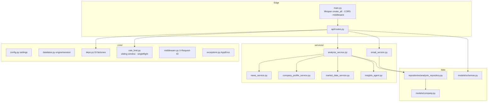
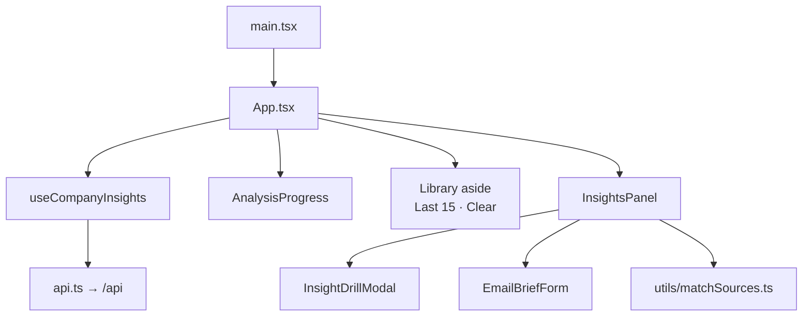
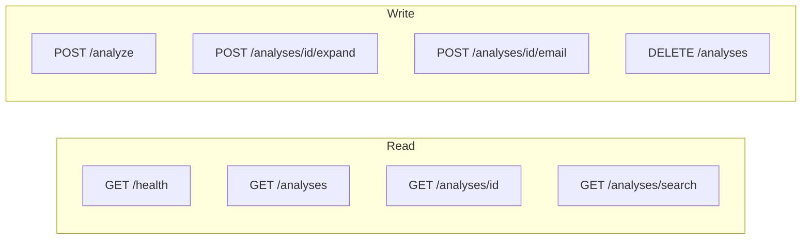
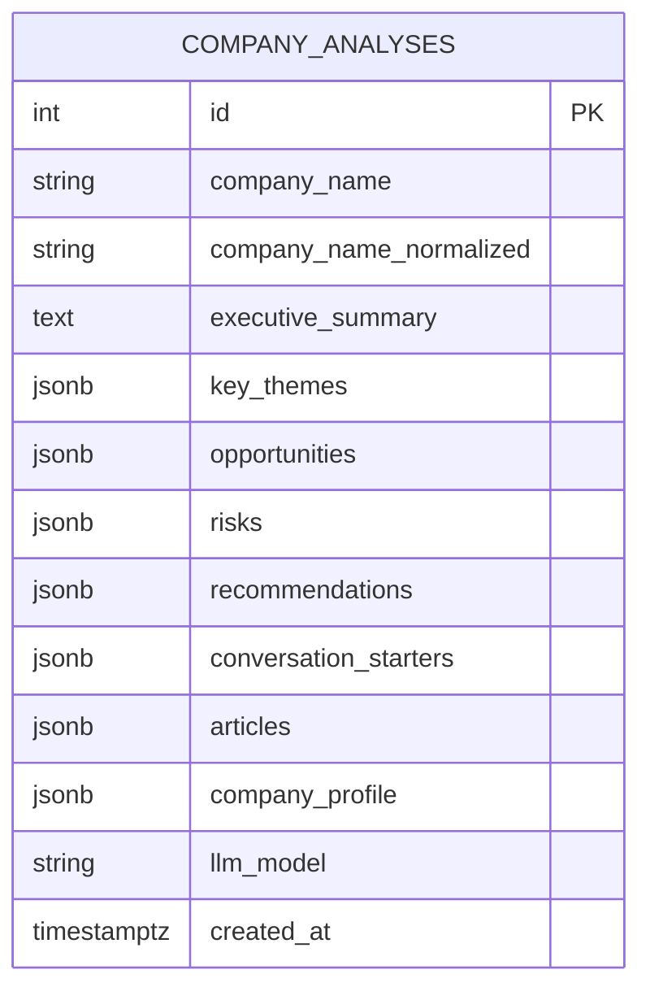
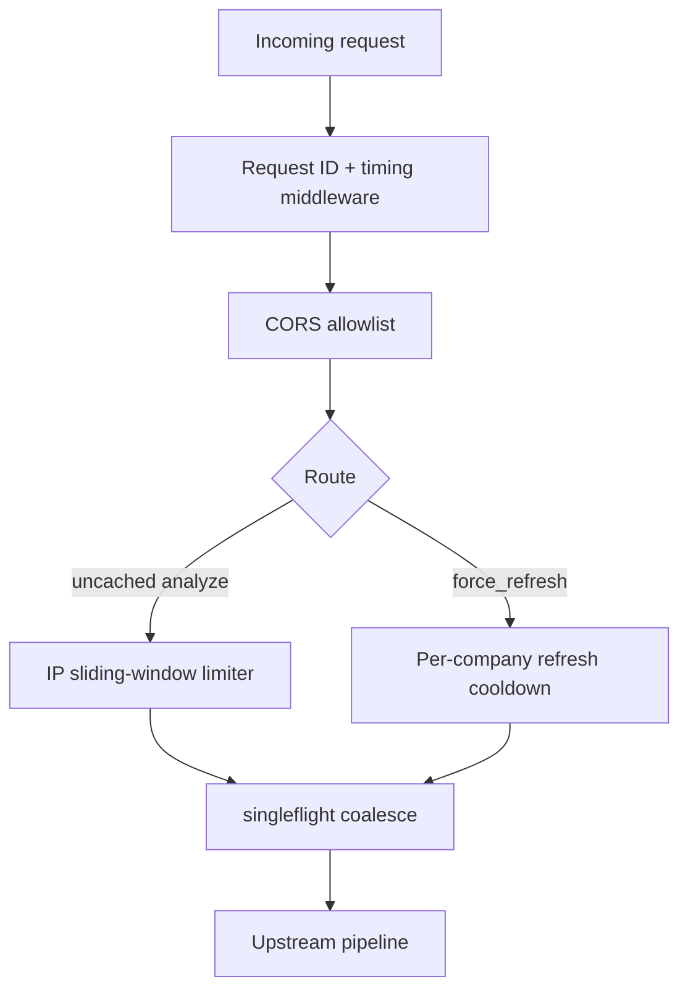
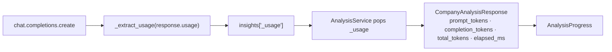
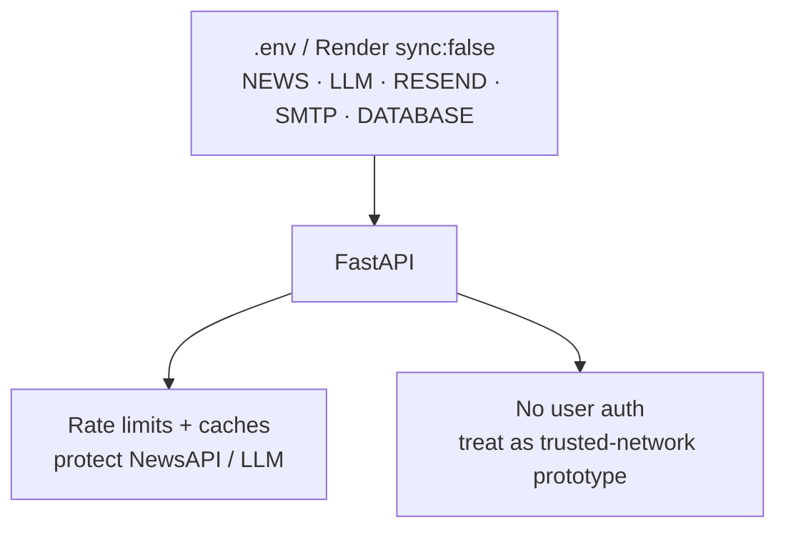

# Architecture 03 — Backend Layers, Frontend Tree, Data Model, API

---

## 1. Backend package layers



**Note:** `alembic` is listed in requirements but there is no migration tree. Schema is created via `Base.metadata.create_all` plus a small `company_profile` column patch at startup.

---

## 2. Frontend component tree



| File | Role |
| --- | --- |
| `App.tsx` | Hero search, status/progress, library chrome |
| `useCompanyInsights.ts` | analyze / open / history / clear / runMetrics |
| `AnalysisProgress.tsx` | % bar, stages, elapsed, token explanation |
| `InsightsPanel.tsx` | Full brief document + refresh + dig triggers |
| `InsightDrillModal.tsx` | Standard + deep expand UI (portal to body) |
| `EmailBriefForm.tsx` | Email brief |
| `config.ts` | `API_BASE`, 120s timeout |
| `vite.config.ts` / `nginx.conf` | `/api` proxy |

---

## 3. API catalog



| Method | Path | Service entry | Used by UI |
| --- | --- | --- | --- |
| GET | `/api/health` | DB `SELECT 1` | healthchecks |
| POST | `/api/analyze` | `AnalysisService.analyze` | Generate / Refresh |
| GET | `/api/analyses` | `list_recent` | Last 15 |
| GET | `/api/analyses/{id}` | `get_by_id` | Library reopen |
| DELETE | `/api/analyses` | `clear_history` | Clear history |
| GET | `/api/analyses/search` | `search` | **No** |
| POST | `/api/analyses/{id}/expand` | `expand_insight` | Dig modal |
| POST | `/api/analyses/{id}/email` | `EmailService` | Email form |

---

## 4. Data model — `company_analyses`



### `company_profile` logical shape

```text
{
  founded, headquarters, employees, parent,
  revenue, operating_income, total_assets,
  key_people: [{ role, name }],
  source, url, matched_label,
  market: {
    ticker, exchange, currency,
    price, change, change_percent,
    market_cap, pe_ratio, sector, industry, ...
  }
}
```

### Not stored in Postgres

- Expand dig-deeper payloads (client memory only)
- Analyze response metrics (`elapsed_ms`, token counts)
- In-memory news TTL cache
- Rate-limit / singleflight maps (process-local)

---

## 5. Cross-cutting controls



| Control | Scope | Notes |
| --- | --- | --- |
| Analyze rate limit | Client IP | Cache hits exempt |
| Refresh cooldown | Normalized company | Default 5 minutes in config |
| Singleflight | Normalized company | Dedupes concurrent identical runs |
| News cache | Process memory | `NEWS_CACHE_MINUTES` |
| Analysis cache | Postgres rows | `ANALYSIS_CACHE_HOURS` |
| Auth | **None** | Open prototype — DELETE clears all |

---

## 6. LLM usage attachment



If the gateway omits usage, the agent estimates tokens from prompt/content length so the UI still shows a signal.

---

## 7. Security / ops diagram notes



Production hardening (not implemented): authn/z, shared Redis rate limits across instances, soft-delete history, per-tenant isolation.
